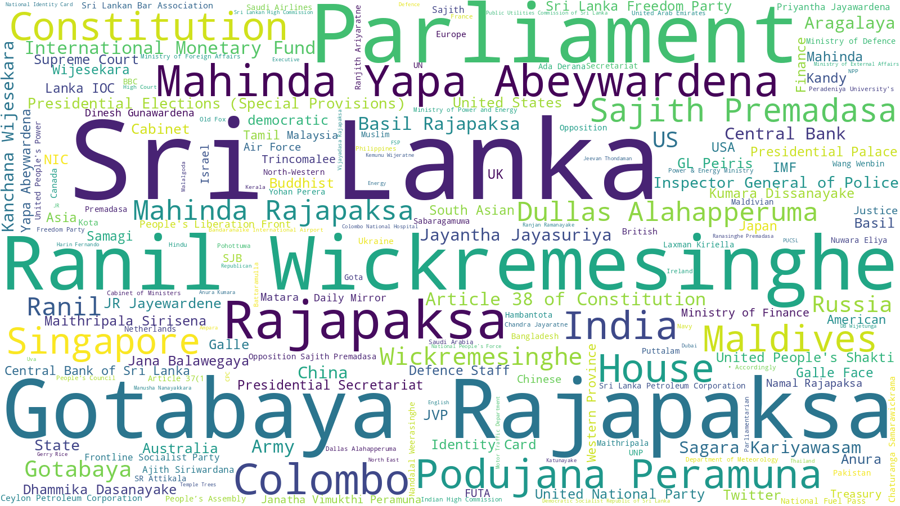

# Sri Lanka News App (Article Summary)

*As of 2022-09-03 15:19:09 (LK time)*

## Last 30 Minutes (2 Articles)

* **1** tamil-mirror-lk ([நடுநிசியில் வரவேற்பு: நண்பகலில் சந்திப்பு](https://github.com/nuuuwan/news_lk2/blob/data/articles/cf/cfc40e7e.json))

* **1** ada-derana-lk ([Price of loaf of bread to increase further](https://github.com/nuuuwan/news_lk2/blob/data/articles/d7/d7156d47.json))

## Last Hour (5 Articles)

* **3** tamil-mirror-lk ([சர்ச்சைக்குரிய சாமியார் ஜனாதிபதி ரணிலுக்கு கடிதம்?](https://github.com/nuuuwan/news_lk2/blob/data/articles/20/20a493c3.json))

* **1** ada-derana-lk ([Price of loaf of bread to increase further](https://github.com/nuuuwan/news_lk2/blob/data/articles/d7/d7156d47.json))

* **1** lankadeepa-lk ([බදු හොරුන්ට උදව් කරන නිලධාරීන් හයසියයක් ගැන පරීක්ෂණ](https://github.com/nuuuwan/news_lk2/blob/data/articles/8e/8e1c4307.json))

## Last 3 Hours (20 Articles)

* **5** news-first-lk ([Tourist arrivals record rise in July](https://github.com/nuuuwan/news_lk2/blob/data/articles/75/7587dc66.json))

* **4** ada-derana-lk ([Veteran actor Anura Medagoda passes away](https://github.com/nuuuwan/news_lk2/blob/data/articles/32/32e2718c.json))

* **4** lankadeepa-lk ([’’අමුත්තන්ගේ රාත්‍රියෙන්’’ 306ක් මාට්ටු](https://github.com/nuuuwan/news_lk2/blob/data/articles/bd/bd4cf7fe.json))

* **3** tamil-mirror-lk ([சர்ச்சைக்குரிய சாமியார் ஜனாதிபதி ரணிலுக்கு கடிதம்?](https://github.com/nuuuwan/news_lk2/blob/data/articles/20/20a493c3.json))

* **2** ada-lk ([දුරකතන, බ්‍රෝඩ්බෑන්ඩ් හා රූපවාහිනී ගාස්තු ඉහළට](https://github.com/nuuuwan/news_lk2/blob/data/articles/60/60acad0e.json))

* **1** daily-mirror-lk ([GR returns](https://github.com/nuuuwan/news_lk2/blob/data/articles/79/79323a68.json))

* **1** economy-next-com ([Sri Lanka coconut prices fall at auction](https://github.com/nuuuwan/news_lk2/blob/data/articles/e3/e3748609.json))

## Last 24 Hours (172 Articles)

* **34** news-first-lk ([18-hr water cut for the weekend](https://github.com/nuuuwan/news_lk2/blob/data/articles/da/da700697.json))

* **33** lankadeepa-lk ([ගුවන් යානා සඳහා දෛනිකව අවශ්‍ය ජෙට්ඉන්ධන ප්‍රමාණවත් නැහැ](https://github.com/nuuuwan/news_lk2/blob/data/articles/15/15b95bd4.json))

* **22** ada-derana-lk ([Court dismisses petition challenging amendments to SLFP constitution](https://github.com/nuuuwan/news_lk2/blob/data/articles/de/de245907.json))

* **21** tamil-mirror-lk ([உறுதிமொழிகள் பெறப்படும்வரை  நிதி உதவி அங்கீகரிக்கப்படாது](https://github.com/nuuuwan/news_lk2/blob/data/articles/3e/3e0d592b.json))

* **21** ada-lk ([බෙහෙත් ගන්න බැසිල්ට ඇමෙරිකාවට යන්න අවසර](https://github.com/nuuuwan/news_lk2/blob/data/articles/4a/4abf3445.json))

* **13** economy-next-com ([Up to 6.3 million people face food insecurity in cash-strapped Sri Lanka: WFP](https://github.com/nuuuwan/news_lk2/blob/data/articles/56/56a8436e.json))

* **12** daily-mirror-lk ([Take action against those responsible before privatising loss-making state entities: AKD](https://github.com/nuuuwan/news_lk2/blob/data/articles/48/48bcdbec.json))

* **10** daily-ft-lk ([Really real manner of managing Sri Lanka](https://github.com/nuuuwan/news_lk2/blob/data/articles/81/81942de3.json))

* **4** island-lk ([Significant net foreign inflows to CSE](https://github.com/nuuuwan/news_lk2/blob/data/articles/2d/2db6ef9c.json))

* **2** colombo-telegraph-com ([Cinematographer Donald Karunaratne, Who Passed Away In LA, Planned Ahas Gawwa Sequel](https://github.com/nuuuwan/news_lk2/blob/data/articles/f4/f4c08fd7.json))

## Last Week (768 Articles)

* **129** lankadeepa-lk ([දවල් මිගෙල් රෑ දනියෙල් ප්‍රකාශකයෝ](https://github.com/nuuuwan/news_lk2/blob/data/articles/1d/1d02aea1.json))

* **100** news-first-lk ([12 more arrests for 9th May violence](https://github.com/nuuuwan/news_lk2/blob/data/articles/03/0307cf2a.json))

* **95** ada-lk ([ව්‍යවසායක සහතික පත්‍ර පාඨමාලාවක් හඳුන්වා දෙයි](https://github.com/nuuuwan/news_lk2/blob/data/articles/60/60e206b6.json))

* **92** daily-mirror-lk ([India responds to Chinese Ambassador’s remarks on SL](https://github.com/nuuuwan/news_lk2/blob/data/articles/dc/dcaea165.json))

* **83** tamil-mirror-lk ([’விருந்தினர்களின் இரவில்’  94 பேர் கைது](https://github.com/nuuuwan/news_lk2/blob/data/articles/f6/f60e5a4b.json))

* **76** ada-derana-lk ([Last Soviet leader Mikhail Gorbachev dies aged 91](https://github.com/nuuuwan/news_lk2/blob/data/articles/71/71faa08d.json))

* **72** economy-next-com ([After rejecting for decades, Sri Lanka politicians now want SOE restructuring amid IMF deal talks](https://github.com/nuuuwan/news_lk2/blob/data/articles/1c/1cd338db.json))

* **51** daily-ft-lk ([Central Bank independence: Issue to the fore again, but will the Government have foresight to do it?](https://github.com/nuuuwan/news_lk2/blob/data/articles/9d/9dc758d4.json))

* **35** island-lk ([Asking for big trouble](https://github.com/nuuuwan/news_lk2/blob/data/articles/df/dfa1395f.json))

* **22** d-b-s-jeyaraj-com ([Sri Lanka is in an economic crisis, there’s no reason to deny it. And yet, Sri Lanka stands firm, unbowed and continues to smile despite trade imbalance, shortage of fuel, gas and fertiliser, and other hardships.](https://github.com/nuuuwan/news_lk2/blob/data/articles/96/96a9319d.json))

* **13** colombo-telegraph-com ([Let’s Have Fun Today](https://github.com/nuuuwan/news_lk2/blob/data/articles/f3/f3c2675e.json))

## All Time (1,102 Articles)

* **193** lankadeepa-lk ([සමෘද්ධි නිලධාරීන්ට එන්නත නැත්නම් රාජකාරියෙන් ඉවත්වෙනවා](https://github.com/nuuuwan/news_lk2/blob/data/articles/ce/ce124b8f.json))

* **145** ada-lk ([ඉතිහාසයේ පළමු වතාවට පරීක්ෂණ දත්ත රැසක් රැස් කරන බැලුනයක් ගුවනට](https://github.com/nuuuwan/news_lk2/blob/data/articles/d0/d03668f2.json))

* **138** daily-mirror-lk ([Children infected with Dengue, COVID-19 on the rise at LRH: Paediatrician](https://github.com/nuuuwan/news_lk2/blob/data/articles/7f/7f703d7c.json))

* **115** d-b-s-jeyaraj-com ([The Galle Face Green activists who brought about a political revolution through non-violent means should now organise themselves into a political force if not a political party to defend the fundamental rights they so valiantly and successfully fought for.](https://github.com/nuuuwan/news_lk2/blob/data/articles/4f/4f93260b.json))

* **106** daily-ft-lk ([Immorality of attack on university students](https://github.com/nuuuwan/news_lk2/blob/data/articles/5c/5cf4124c.json))

* **100** news-first-lk ([12 more arrests for 9th May violence](https://github.com/nuuuwan/news_lk2/blob/data/articles/03/0307cf2a.json))

* **84** tamil-mirror-lk ([ஒரே பார்வையில் அன்டனோவ் ஏ.என் 225](https://github.com/nuuuwan/news_lk2/blob/data/articles/ea/ea3da9ff.json))

* **76** ada-derana-lk ([Last Soviet leader Mikhail Gorbachev dies aged 91](https://github.com/nuuuwan/news_lk2/blob/data/articles/71/71faa08d.json))

* **72** economy-next-com ([After rejecting for decades, Sri Lanka politicians now want SOE restructuring amid IMF deal talks](https://github.com/nuuuwan/news_lk2/blob/data/articles/1c/1cd338db.json))

* **47** island-lk ([Gotabaya Rajapaksa, in retrospect](https://github.com/nuuuwan/news_lk2/blob/data/articles/40/406a09fd.json))

* **26** colombo-telegraph-com ([President Wickremesinghe, The Current Pohottuwa Government & The Way Forward – A Call From Citizens](https://github.com/nuuuwan/news_lk2/blob/data/articles/58/586171b0.json))