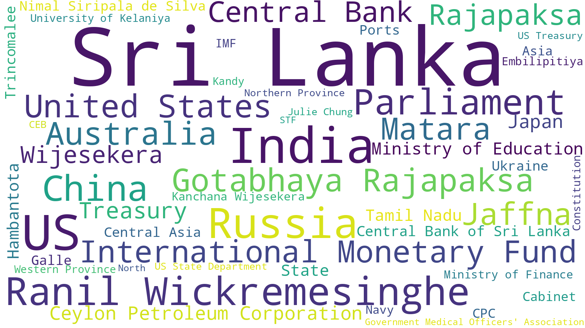

# Sri Lanka News App (Article Summary)

*As of 2022-06-27 19:44:24 (LK time)*

## Last 30 Minutes (4 Articles)

* **2** lankadeepa-lk ([ඉන්ධන ආනයනයට කඩිනම් පියවර ගන්න](https://github.com/nuuuwan/news_lk2/blob/data/articles/80/801ebdeb.json))

* **1** ada-derana-lk ([President instructs officials to use available funds to import fuel](https://github.com/nuuuwan/news_lk2/blob/data/articles/99/99ff2475.json))

* **1** tamil-mirror-lk ([ரஷ்ய தூதுவரை சந்தித்தார் ஜனாதிபதி](https://github.com/nuuuwan/news_lk2/blob/data/articles/5c/5cd988a1.json))

## Last Hour (15 Articles)

* **8** lankadeepa-lk ([රජයේ සමස්ත ණය ඉහළට](https://github.com/nuuuwan/news_lk2/blob/data/articles/55/55bb29ef.json))

* **3** tamil-mirror-lk ([மின் கட்டணத்தை அதிகரிக்க கோரிக்கை](https://github.com/nuuuwan/news_lk2/blob/data/articles/13/1338f42e.json))

* **2** daily-mirror-lk ([Not possible to purchase fuel from any nation: Champika](https://github.com/nuuuwan/news_lk2/blob/data/articles/f5/f5da313f.json))

* **1** ada-derana-lk ([President instructs officials to use available funds to import fuel](https://github.com/nuuuwan/news_lk2/blob/data/articles/99/99ff2475.json))

* **1** economy-next-com ([Sri Lanka stocks fall to one-week low; dragged down by acute fuel shortage](https://github.com/nuuuwan/news_lk2/blob/data/articles/17/17236186.json))

## Last 3 Hours (49 Articles)

* **16** lankadeepa-lk ([අධ්‍යාපනයේ වැඩ බලන්න  බන්දුලට පවරයි](https://github.com/nuuuwan/news_lk2/blob/data/articles/be/be0415c9.json))

* **10** daily-mirror-lk ([No scientific approach or formula followed during recent fuel price revision](https://github.com/nuuuwan/news_lk2/blob/data/articles/21/21d76e7d.json))

* **6** ada-lk ([ඉන්ධන පෝලිමේ බසයක් ගැටී 03කට බරපතල තුවාල](https://github.com/nuuuwan/news_lk2/blob/data/articles/f2/f2320175.json))

* **5** tamil-mirror-lk ([தலையை துண்டாக்கிய  நீண்ட கால பகை](https://github.com/nuuuwan/news_lk2/blob/data/articles/12/1259bf0e.json))

* **5** economy-next-com ([Sri Lanka regulator proposes average power tariff hike to Rs32 a uni](https://github.com/nuuuwan/news_lk2/blob/data/articles/9f/9faa8da8.json))

* **3** news-first-lk ([COPA calls for Road-Map on Gas Exploration in Sri Lanka](https://github.com/nuuuwan/news_lk2/blob/data/articles/8d/8d71218f.json))

* **2** ada-derana-lk ([54 persons attempting to illegally migrate from island held in eastern seas](https://github.com/nuuuwan/news_lk2/blob/data/articles/46/46fd1908.json))

* **2** virakesari-lk ([எரிவாயு விநியோகம் குறித்து லாஃப் எரிவாயு நிறுவனம் விடுத்துள்ள வேண்டுகோள்](https://github.com/nuuuwan/news_lk2/blob/data/articles/86/864d72d0.json))

## Last 24 Hours (302 Articles)

* **84** lankadeepa-lk ([සියඹලාණ්ඩුව රෝහලත් වැසෙයි](https://github.com/nuuuwan/news_lk2/blob/data/articles/64/645d224b.json))

* **46** ada-lk ([කොළඹ පාසල් හා අනෙකුත් නගරබද පාසල්වලට නිවාඩු දෙයි](https://github.com/nuuuwan/news_lk2/blob/data/articles/1f/1f5a04a4.json))

* **42** daily-mirror-lk ([Kangaroo Vs Lions ; 140-Yr Sticks & Stones Rivalry Reconciled  with All-Yellow Bat & Ball Game](https://github.com/nuuuwan/news_lk2/blob/data/articles/8b/8b1b31e2.json))

* **33** virakesari-lk ([கொட்டகலையில் பதுக்கி வைக்கப்பட்டதாகக் கூறப்படும் ஆயிரம் லீற்றர் டீசல் மீட்பு  - ஒருவர் கைது](https://github.com/nuuuwan/news_lk2/blob/data/articles/03/03244b0f.json))

* **27** tamil-mirror-lk ([சிகிச்சை வழங்குவதில் சிக்கல்](https://github.com/nuuuwan/news_lk2/blob/data/articles/2d/2d7f5f2d.json))

* **21** news-first-lk ([US delegation to meet PM today](https://github.com/nuuuwan/news_lk2/blob/data/articles/05/05183caf.json))

* **17** ada-derana-lk ([Petrol stored in container caused Kahatuduwa house fire?](https://github.com/nuuuwan/news_lk2/blob/data/articles/b0/b089687f.json))

* **15** economy-next-com ([Sri Lanka’s Bank of Ceylon downgraded to RD](https://github.com/nuuuwan/news_lk2/blob/data/articles/3c/3c6e479d.json))

* **12** daily-ft-lk ([Financial literacy: A closer look at Sri Lanka – Part 1](https://github.com/nuuuwan/news_lk2/blob/data/articles/a5/a57b94ef.json))

* **3** colombo-telegraph-com ([Child’s Guide To Debt Restructuring: Not A Cakewalk But A Task Entailing Hard Work](https://github.com/nuuuwan/news_lk2/blob/data/articles/e8/e8965a93.json))

* **2** b-b-c-com-sinhala ([LGBTQI ප්‍රජාව ; ''අපිට සැබෑ අයිතියක් තියෙනවා රටේ ප්‍රශ්න ගැන කතා කරන්න.''](https://github.com/nuuuwan/news_lk2/blob/data/articles/2c/2c73f35e.json))

## Last Week (1,946 Articles)

* **394** lankadeepa-lk ([පෝර ගැන සුබ පණිවිඩයක් එහෙත් බෙදීම ක්‍රමයකට ඕනෑ](https://github.com/nuuuwan/news_lk2/blob/data/articles/cc/cc62e0a0.json))

* **356** daily-mirror-lk ([None](https://github.com/nuuuwan/news_lk2/blob/data/articles/e9/e9fa19a7.json))

* **206** virakesari-lk ([இயங்காநிலை நோக்கி நகரும் இலங்கை](https://github.com/nuuuwan/news_lk2/blob/data/articles/74/74c51d5d.json))

* **195** ada-lk ([ඇමෙරිකාවෙන් ඩො.මිලියන  5.75ක අතිරේක ආධාරයක්](https://github.com/nuuuwan/news_lk2/blob/data/articles/bd/bd2485fb.json))

* **182** news-first-lk ([None](https://github.com/nuuuwan/news_lk2/blob/data/articles/2e/2e866adf.json))

* **159** tamil-mirror-lk ([None](https://github.com/nuuuwan/news_lk2/blob/data/articles/ed/edf2c0f8.json))

* **141** ada-derana-lk ([None](https://github.com/nuuuwan/news_lk2/blob/data/articles/86/8623cfdf.json))

* **104** economy-next-com ([None](https://github.com/nuuuwan/news_lk2/blob/data/articles/8a/8aa73853.json))

* **92** daily-ft-lk ([Open letter to Sajith: Lead or leave](https://github.com/nuuuwan/news_lk2/blob/data/articles/9a/9a41ace3.json))

* **63** island-lk ([None](https://github.com/nuuuwan/news_lk2/blob/data/articles/d0/d0090d8a.json))

* **30** d-b-s-jeyaraj-com ([None](https://github.com/nuuuwan/news_lk2/blob/data/articles/00/00ff4682.json))

* **13** colombo-telegraph-com ([Lanka’s Quest For Stability](https://github.com/nuuuwan/news_lk2/blob/data/articles/0a/0a8cea9e.json))

* **11** b-b-c-com-sinhala ([ඕස්ට්‍රේලියාවට එරෙහි අද තරගයෙන් ශ්‍රී ලංකාවේ පැතුම ඉටුවෙයිද?](https://github.com/nuuuwan/news_lk2/blob/data/articles/44/44ea68c9.json))

## All Time (16,866 Articles)

* **5,937** daily-mirror-lk ([None](https://github.com/nuuuwan/news_lk2/blob/data/articles/1c/1cb441c3.json))

* **3,113** news-first-lk ([None](https://github.com/nuuuwan/news_lk2/blob/data/articles/8a/8aa92535.json))

* **2,460** ada-derana-lk ([None](https://github.com/nuuuwan/news_lk2/blob/data/articles/a5/a5097f40.json))

* **1,621** economy-next-com ([None](https://github.com/nuuuwan/news_lk2/blob/data/articles/63/638b9440.json))

* **1,260** daily-ft-lk ([None](https://github.com/nuuuwan/news_lk2/blob/data/articles/01/01373e30.json))

* **1,150** island-lk ([None](https://github.com/nuuuwan/news_lk2/blob/data/articles/d2/d2d1439a.json))

* **510** lankadeepa-lk ([සමෘද්ධි නිලධාරීන්ට එන්නත නැත්නම් රාජකාරියෙන් ඉවත්වෙනවා](https://github.com/nuuuwan/news_lk2/blob/data/articles/ce/ce124b8f.json))

* **251** ada-lk ([ඉතිහාසයේ පළමු වතාවට පරීක්ෂණ දත්ත රැසක් රැස් කරන බැලුනයක් ගුවනට](https://github.com/nuuuwan/news_lk2/blob/data/articles/d0/d03668f2.json))

* **212** virakesari-lk ([யூதர்களுக்கு காலக்கெடுவாக அமைந்துள்ள ஜெரூஸலம்](https://github.com/nuuuwan/news_lk2/blob/data/articles/da/da5d0c4b.json))

* **159** tamil-mirror-lk ([None](https://github.com/nuuuwan/news_lk2/blob/data/articles/ed/edf2c0f8.json))

* **125** d-b-s-jeyaraj-com ([None](https://github.com/nuuuwan/news_lk2/blob/data/articles/3a/3aec9eac.json))

* **31** colombo-telegraph-com ([UN Body Condemns Sri Lanka’s Criminalization Of Same-Sex Acts: Landmark Case Highlights ‘Sodomy’ Law’s Impact On Women](https://github.com/nuuuwan/news_lk2/blob/data/articles/bb/bb2c642a.json))

* **27** b-b-c-com-sinhala ([මන්නාරම සහ පූනරීන්හි සුළංබල ව්‍යාපෘති දියත්කරන ගෞතම් අදානි කවුද?](https://github.com/nuuuwan/news_lk2/blob/data/articles/26/263aeefa.json))

* **10** daily-news-lk ([None](https://github.com/nuuuwan/news_lk2/blob/data/articles/16/16b9acba.json))